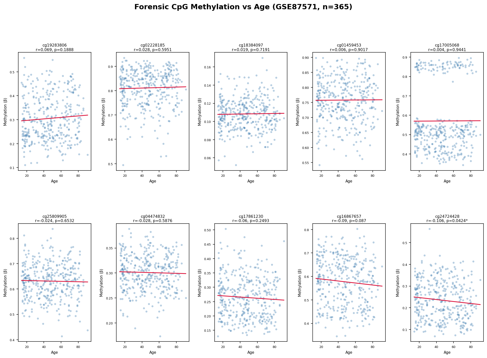

# Forensic Epigenetic Age Estimation

## Overview
This project investigates the relationship between DNA methylation and chronological age 
using 10 forensically relevant CpG sites across 365 blood samples from the publicly 
available GSE87571 dataset (Illumina 450K array).

## Dataset
- **Source:** GEO (GSE87571)
- **Samples:** 365 whole blood samples
- **Age range:** 18–88 years
- **Platform:** Illumina HumanMethylation450 BeadChip

## Methods
- CpG extraction and beta value processing in Python
- Pearson correlation of methylation (β values) with chronological age
- Visualisation of methylation trajectories across 10 forensic CpG sites

## Key Findings
- **cg24724428** showed the strongest significant negative correlation with age (r = -0.106, p = 0.0424)
- **cg16867657** showed a borderline negative trend (r = -0.090, p = 0.087)
- Most CpGs showed weak correlations in this dataset, consistent with known 
  population-level variability in epigenetic ageing

## Tools Used
- Python (pandas, scipy, matplotlib)
- Google Colab
- NCBI GEO public data

## Output

